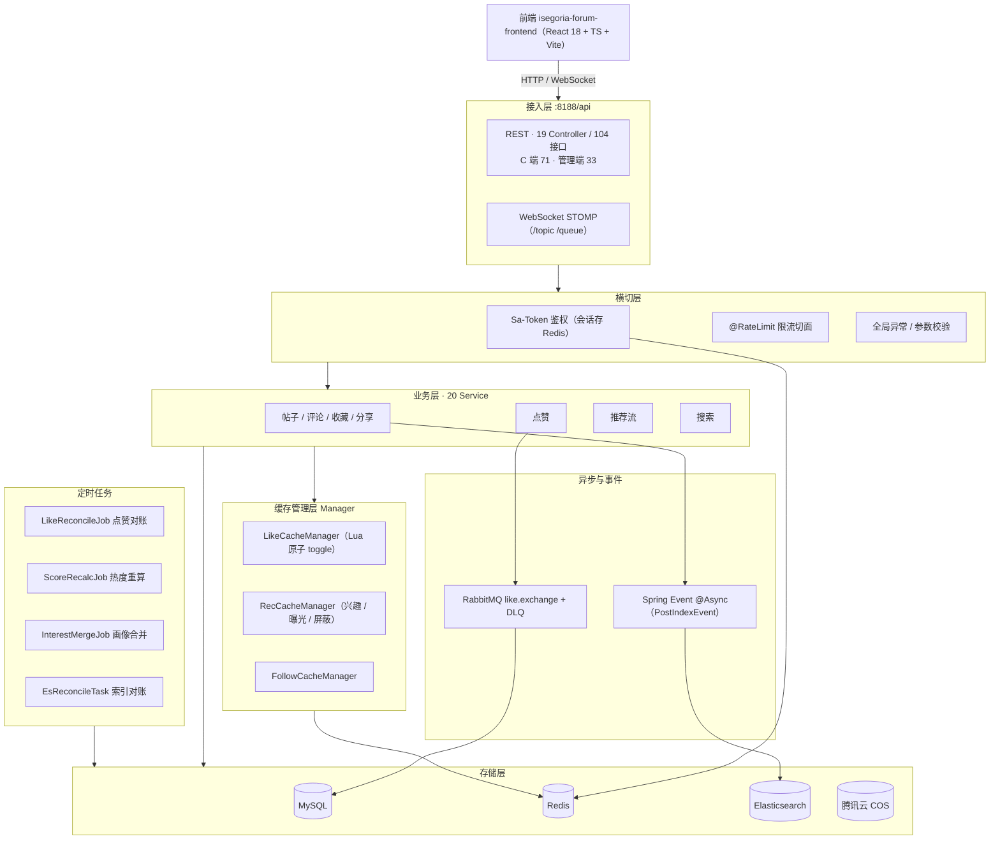
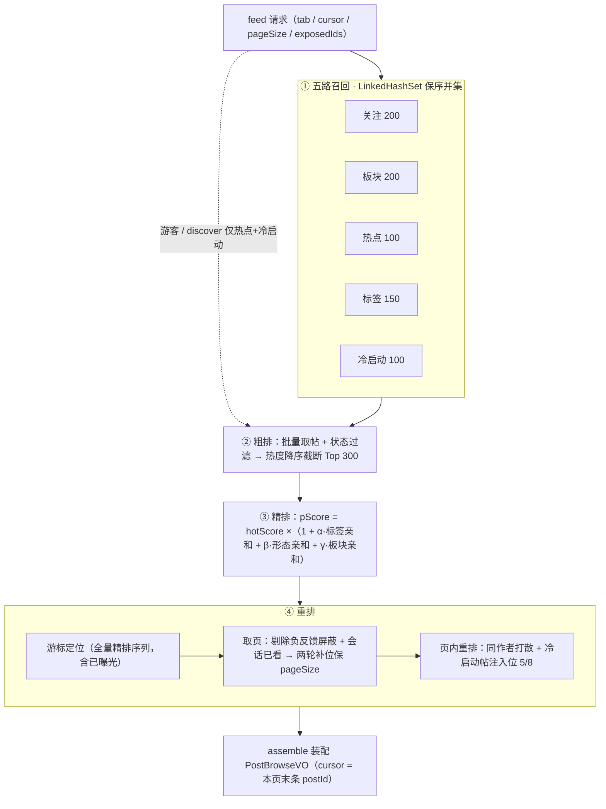
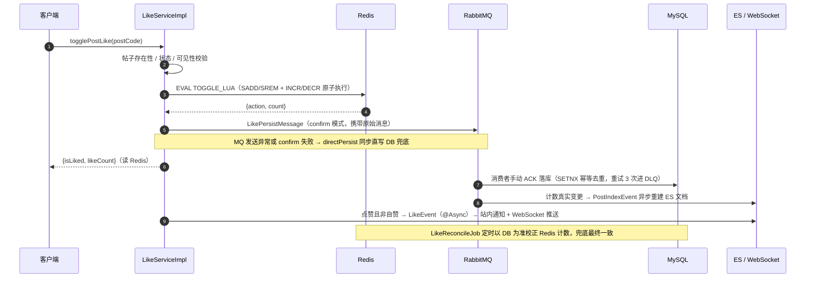
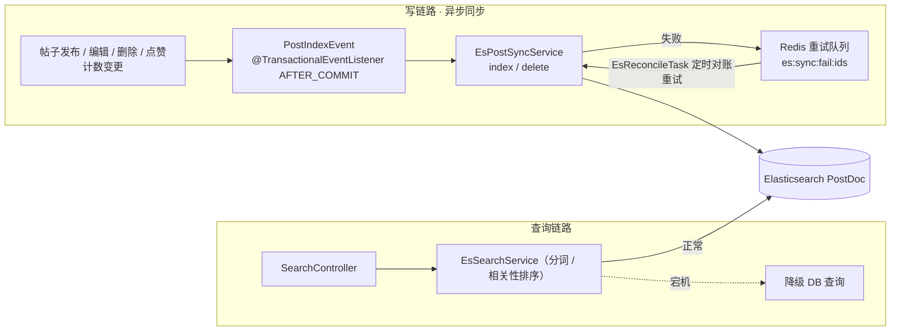

# IsegoriaForum

基于 Spring Boot 3 的论坛社区后端系统，涵盖帖子、评论、点赞、收藏、分享、关注、通知、浏览历史等完整社区功能，并内置 **规则驱动四层漏斗推荐流** 与 **Elasticsearch 全文搜索**。配套前端仓库：`isegoria-forum-frontend`（React 18 + TypeScript + Vite）。

## 技术栈

| 分类 | 选型 |
|---|---|
| 框架 | Spring Boot 3.0.2 / Java 17 |
| ORM | MyBatis-Plus 3.5.17（逻辑删除、分页插件） |
| 认证 | Sa-Token 1.41（登录态存 Redis，Cookie 模式，滑动续期） |
| 缓存 | Redis（Lettuce 连接池，业务缓存 + Lua 原子脚本） |
| 消息队列 | RabbitMQ（publisher confirm + 手动 ACK + 本地重试 3 次进 DLQ） |
| 搜索 | Elasticsearch（Spring Data ES，PostDoc 索引 + 事务后异步事件同步） |
| 实时推送 | WebSocket（STOMP，关注成功后实时通知） |
| 对象存储 | 腾讯云 COS（帖子图片） |
| 接口文档 | Knife4j / SpringDoc OpenAPI 3 |
| 其他 | Hutool、Hibernate Validator、AOP 限流切面（`@RateLimit`） |

## 功能模块

- **用户**：注册 / 登录 / 个人信息，Sa-Token 会话管理（多端在线、30 分钟滑动续期）
- **帖子**：发布 / 编辑 / 分页浏览，支持板块（Board）、标签（Tag）、可见性、审核状态（敏感词过滤）
- **互动**：点赞（帖子 / 评论）、收藏、分享、评论（楼中楼）
- **关注**：用户关注 / 板块关注，关注关系 Redis 缓存
- **通知**：点赞 / 评论 / 关注等事件通知 + WebSocket 实时推送
- **浏览历史**：记录 / 查询 / 删除 / 清空
- **推荐流**：四层漏斗（召回 → 粗排 → 精排 → 重排），游标分页，冷启动注入，负反馈「不感兴趣」屏蔽，会话级曝光去重
- **搜索**：ES 全文检索，帖子索引在事务提交后异步事件同步，失败进 Redis 重试队列由 `EsReconcileTask` 定时对账
- **热度分**：按点赞 / 评论 / 收藏 / 分享加权 + 时间衰减（tauHours）计算帖子 score

## 总体架构



## 架构与目录结构

```
src/main/java/com/ruwei/
├── IsegoriaForumApplication.java   # 启动类
├── annotation/                     # 自定义注解（@RateLimit 等）
├── common/                         # 通用返回、错误码、工具
├── component/
├── config/                         # 配置类（MybatisPlus / SaToken / RabbitMQ / WebSocket / CORS / COS / 异步 / JSON）
├── controller/                     # C 端接口（12 Controller / 71 接口）
│   └── manager/                    #   管理端接口（7 Controller / 33 接口）
├── domain/
│   ├── Enum/                       # 枚举（帖子状态、审核状态、可见性等）
│   ├── dto / vo / empty(实体)      # 数据传输对象 / 视图对象 / 数据库实体
├── es/                             # Elasticsearch 模块
│   ├── doc/PostDoc.java            #   帖子索引文档
│   ├── listener/                   #   事务后异步事件监听（索引 / 用户画像同步）
│   ├── service/                    #   EsSearchService / EsPostSyncService
│   └── controller/SearchController.java
├── exception/                      # 全局异常处理
├── manager/                        # 缓存管理器（LikeCacheManager / RecCacheManager / FollowCacheManager / CosManager / ScoreConfigManager）
├── mapper/                         # MyBatis-Plus Mapper
├── schedule/                       # 定时任务
│   ├── LikeReconcileJob.java       #   点赞计数对账（以 DB 为准校正 Redis）
│   ├── ScoreRecalcJob.java         #   热度分重算（权重可配，变化量阈值防写放大）
│   ├── InterestMergeJob.java       #   短期兴趣 → 长期画像合并
│   └── EsReconcileTask.java        #   ES 索引对账
└── service/                        # 业务逻辑（20 个 Service）
```

## 核心设计

### 推荐流（四层漏斗）

`RecServiceImpl` 实现规则驱动的推荐管线，所有调参收口在 `application-sorce.yml` 的 `rec.*` 配置：

1. **召回**：五路召回（关注 / 板块 / 热点 / 标签 / 冷启动，LinkedHashSet 保序并集），各路上限可配
2. **粗排**：按热度分截断（默认 top 300）
3. **精排**：热度分 + 亲和分（标签 α / 内容形态 β / 板块 γ），画像来自 `UserInterest`（短期 + 长期）
4. **重排**：同作者打散 + 冷启动帖固定注入位

接口为**游标分页**（cursor = 上页最后一条 postId），支持：
- **负反馈屏蔽**：「不感兴趣」帖写入全局屏蔽键，7 天内不再出现且永不补位放出
- **会话级去重**：前端内存记录本会话已看帖（`exposedIds`）随请求上传，服务端剔除；F5 刷新自动清空，看过的帖重新出现
- **两轮补位**：未曝光帖优先，不足 pageSize 时用会话已看帖按精排分补位，保证永不空屏



### 点赞高并发

`LikeCacheManager` 用 **Redis Lua 脚本**（`TOGGLE_LUA`）保证「关系 Set 增删 + 计数 INCR/DECR」的原子性；点赞落库通过 **RabbitMQ 异步持久化**（publisher confirm + `LikeCorrelationData` 携带原始消息），`LikeReconcileJob` 定时以数据库为准校正 Redis 计数，实现最终一致性。



### 搜索与数据同步

帖子索引同步采用「事务提交后异步事件 + 失败重试对账」：



- **写链路**：帖子发布 / 编辑 / 删除（及点赞计数真实变更）在事务 `AFTER_COMMIT` 后发布 `PostIndexEvent`，`@Async` 监听器调用 `EsPostSyncService` 写 ES；同步失败不影响主流程，失败 id 落 Redis 重试队列（`es:sync:fail:ids`），由 `EsReconcileTask` 定时对账重试，保证最终一致
- **查询链路**：`SearchController → EsSearchService` 提供分词与相关性排序检索；ES 宕机时降级 DB 查询，搜索可用性不依赖单点（详见 [ES宕机容灾分析报告.md](ES宕机容灾分析报告.md)）

### 接口约定

- 统一响应体 + 全局异常处理；请求/响应 DTO 均校验
- 所有实体 ID 使用雪花算法，DTO/VO 中 Long 统一 **字符串序列化**（防前端 JS 精度丢失）
- 数据库列名与实体字段同为驼峰（`map-underscore-to-camel-case: false`），逻辑删除字段 `isDelete`
- 写接口通过 `@RateLimit` AOP 切面限流（Redis 计数）

## 快速开始

### 环境要求

- JDK 17+、Maven 3.6+
- MySQL 8（数据库 `frorum`，建表脚本见 `sql/sql.sql`）
- Redis 6+
- RabbitMQ 3.x
- Elasticsearch 8（可选，搜索模块依赖）

### 步骤

1. 初始化数据库：执行 `sql/sql.sql`
2. 按需修改 `src/main/resources/application.yml` 中的 MySQL / Redis / RabbitMQ / ES 连接信息（敏感配置建议放 `application-local.yml`，已默认激活 `local, sorce` 两个 profile）
3. 启动：

```bash
mvn spring-boot:run
```

> **JDK 17 注意**：JPMS 强封装下，Sa-Token / Hutool / springdoc 的反射序列化需要 `--add-opens` 参数。`mvn spring-boot:run` 已在 pom 中配置；**IDE 直接启动**时需在 Run Configuration 的 VM options 中手动加上同样参数（见 pom.xml `jvmArguments` 段）。

4. 访问接口文档：Knife4j UI `http://localhost:8188/api/doc.html`（Swagger UI `/api/swagger-ui.html`）

服务端口 `8188`，统一前缀 `/api`；CORS 白名单在 `application.yml` 的 `cors.allowed-origins` 中配置（生产环境务必替换为真实域名，严禁 `*`）。

## 相关文档

- [ES搜索接入方案与实施计划.md](ES搜索接入方案与实施计划.md) —— 搜索模块的完整设计与实施
- [ES宕机容灾分析报告.md](ES宕机容灾分析报告.md) —— ES 不可用时的降级容灾分析
- [docs/modules/](docs/modules/) —— 模块级设计与评审文档
- [.workbuddy/memory/](.workbuddy/memory/) —— 开发过程工作日志（模块评审、压测复盘、方案决策记录）
